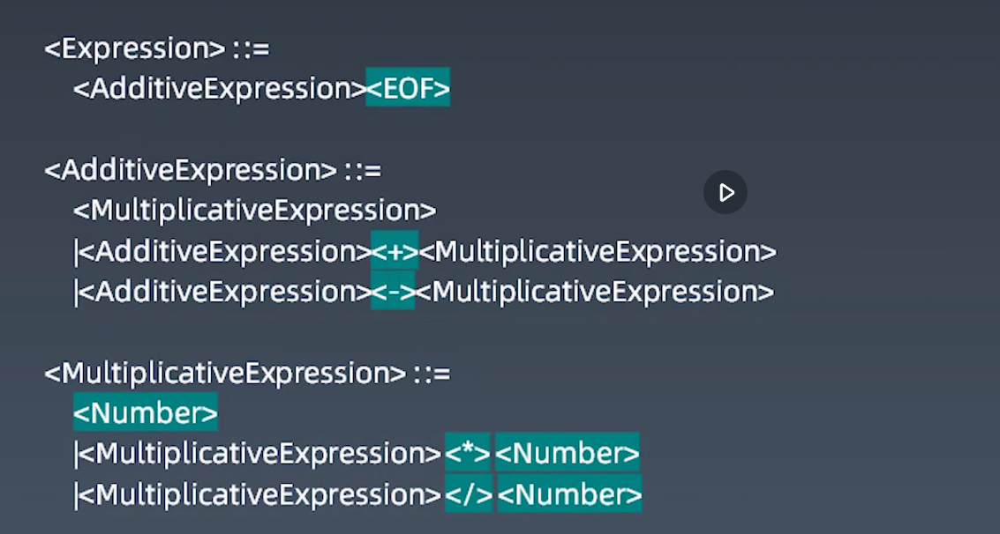

# LL算法

从左（ L） 向右读入程序，最左（ L） 推导，采用一个（ 1） 前看符号(lookhead，这个前看符号是用来作辅助判断用的，也就是说这个前看符号就是用来查LL(1)分析表的)

分析算法本质上，就是用栈来显示地实现非递归版本的递归下降分析，或者说非递归版本的树的遍历的一个过程。

## 分词
使用正则简单匹配
```js
    const regex = /([0-9\.]+)|([ \t]+)|([\r\n]+)|(\*)|(\/)|(\+)|(\-)/g;
    const Dict = [
        '',
        'Number',
        'Whitespace',
        'LineTerminator',
        '*',
        '/',
        '+',
        '-',
    ];
```
通过匹配位置查找对应位置的字典就可以完成分词

## 规则匹配
关键是写出四则运算的规则：

