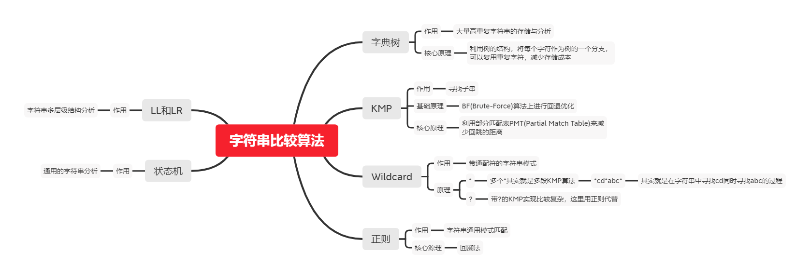

# 字符串算法

# 小技巧

## 使用Symbol可以避免访问对象中可能可用字符

在字典树中，由于所有字符都是有可能会被使用到的，因此如果需要用一个属性去区分所有的字符，采用Symbol是比较合适的方案

## Objec.create使用注意 

使用Object.create(null)创建的对象，Ta将没有任何Object原型链上的方法（hasOwnProperty、toString），这样的好处是：

- 你可以在上面定义任何方法，不用担心会覆盖原型链上的方法。
- 使用for in的时候不用考虑会遍历对象原型链上的属性

但是正是因为这样，如果用一些通用的方法，比如很多库会有判断对象类型的方法，会使用toString()来判断，此时该对象就不适用了

所以，我们使用Object.create(null)的时候，要明确我们的目的

- 当你需要一个非常干净且高度可定制的对象当作数据字典的时候；
- 想节省hasOwnProperty带来的一丢丢性能损失并且可以偷懒少些一点代码的时候

可以使用用Object.create(null)吧，其他时候，请用{}。
