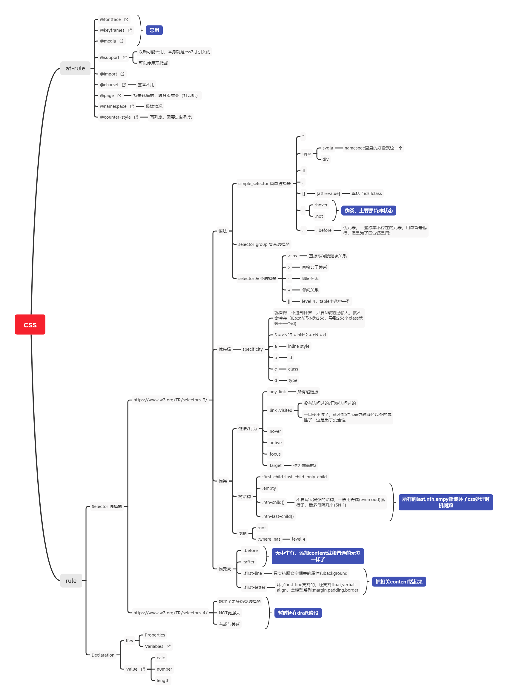

# 学习笔记
## 为什么 first-letter 可以设置 float 之类的，而 first-line 不行呢？

个人理解：first-letter 的内容是确定的，不会以为布局变化而产生变化。
但是 first-line 的content则是需要计算的，任何样式布局上的变化，都可能导致content的取值发生变化。

## 爬虫

在一个同域的页面上开启一个iframe就可以构建一个小型爬虫，不需要考虑跨域问题

## 思维导图

